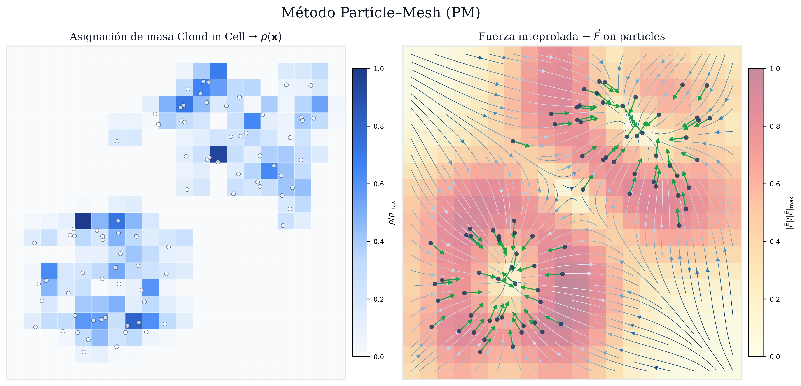
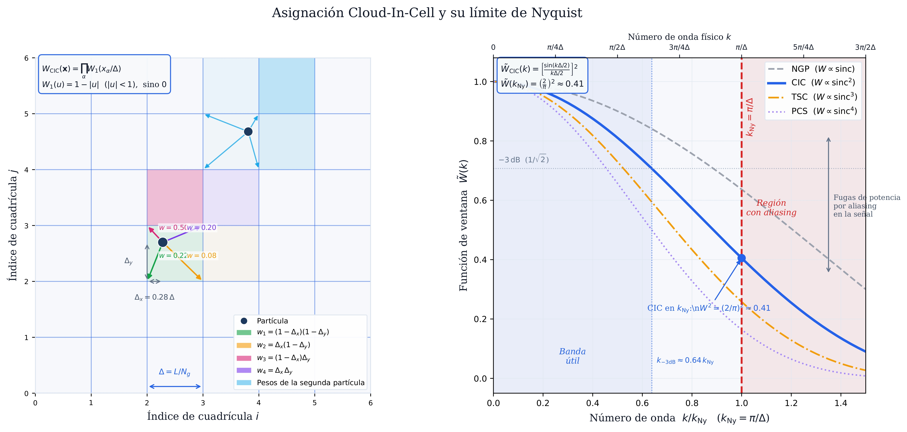
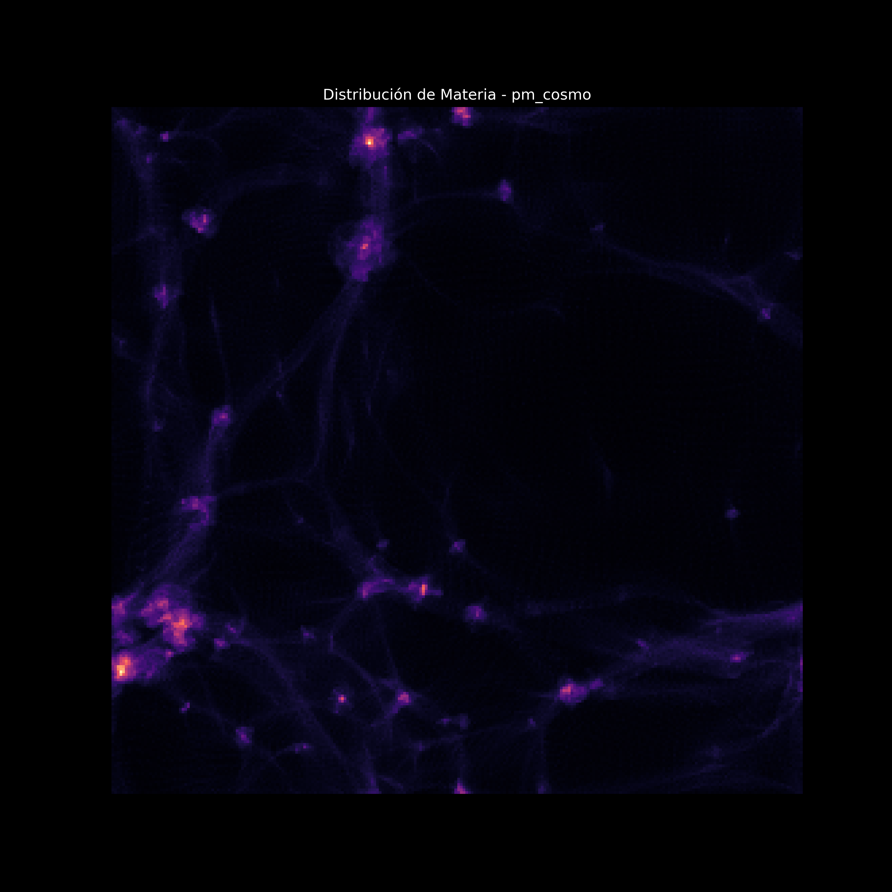
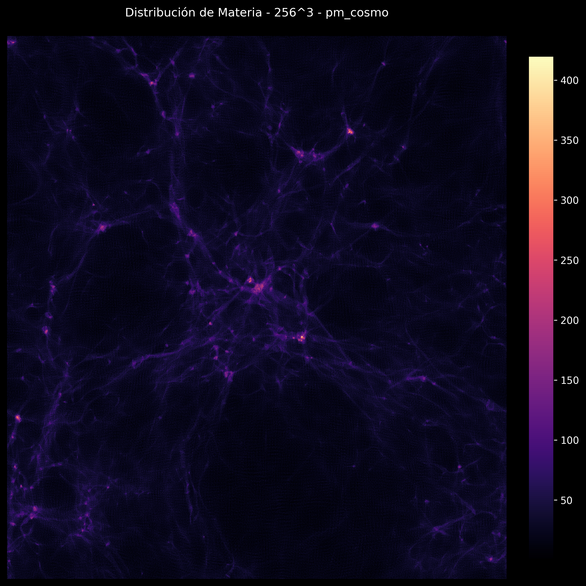

# Contexto y objetivo

## ¿Qué problema resolvemos?

En el estudio cosmológico del universo al disponer solo de observaciones actuales, las **simulaciones numéricas** son la herramienta clave para entender cómo se formaron las estructuras a gran escala.

La estructura a gran escala del universo (filamentos, vacíos, cúmulos) son un proceso que emerge de
la **inestabilidad gravitacional** sobre pequeñas fluctuaciones de densidad iniciales.

Simular este proceso requiere seguir el movimiento de $N$ partículas de materia oscura
bajo su mutua atracción gravitacional durante millones de años.

::: {.callout-note}
## Objetivo de la exposición

Implementar y paralelizar con OpenMP el método **Particle-Mesh** (PM),
la aproximación más eficiente para gravitación de largo alcance en cosmología.
:::

## El método Particle-Mesh en una línea


{width=100%}

$$\underbrace{\text{p}}_{\mathbf{x}_i, \mathbf{v}_i} \xrightarrow{\text{CIC}} \underbrace{\rho(\mathbf{x})}_{\text{malla}} \xrightarrow{\text{FFT}} \underbrace{\hat{\phi}(\mathbf{k})}_{\text{Fourier}} \xrightarrow{\times(-4\pi G/k^2)} \underbrace{\phi(\mathbf{x})}_{\text{potencial}} \xrightarrow{-\nabla} \underbrace{\mathbf{g}(\mathbf{x})}_{\text{fuerza}} \xrightarrow{\text{interp}} \underbrace{\mathbf{a}_i}_{\text{partículas}} \xrightarrow{\text{LF}} \underbrace{\mathbf{x}_i', \mathbf{v}_i'}_{\text{paso } n+1}$$


Complejidad por paso: $O (N_g \log N_g)$ en lugar de $O (N^2)$

# Física del simulador

## Ecuación de Poisson gravitacional

La relación entre el potencial $\phi$ y la densidad de masa $\rho$ es:

$$
\nabla^2 \phi(\mathbf{x}) = 4\pi G\, \rho(\mathbf{x})
$$

En espacio de Fourier esto se convierte en una **multiplicación algebraica**:

$$
\hat{\phi}(\mathbf{k}) = -\frac{4\pi G\, \hat{\rho}(\mathbf{k})}{k^2}
\qquad k^2 = k_x^2 + k_y^2 + k_z^2
$$

::: {.callout-tip}
El modo $k=0$ (densidad de fondo) se pone a cero: $\hat{\phi}(\mathbf{0}) = 0$.
Esto equivale a trabajar con el **contraste de densidad** $\delta = \rho/\bar{\rho} - 1$.
:::

## Campo gravitacional — diferencias finitas centradas

A partir del potencial calculamos la aceleración gravitacional con diferencias centradas de **segundo orden**:

$$
g_x(i,j,k) = -\frac{\phi(i{+}1,j,k) - \phi(i{-}1,j,k)}{2\Delta x}
$$

$$
g_y(i,j,k) = -\frac{\phi(i,j{+}1,k) - \phi(i,j{-}1,k)}{2\Delta y}
$$

Las condiciones de **frontera periódicas** se manejan con índices módulo $N_g$.

::: {.callout-note}
Esto equivale a la multiplicación por el kernel de Green $-4\pi G / k^2$ en espacio de Fourier.
:::

## Integrador Leap-Frog

Integrador **simpléctico** de orden 2: conserva el volumen en el espacio de fase $(x, v)$.

$$
\mathbf{v}_{n+1/2} = \mathbf{v}_{n-1/2} + \mathbf{a}_n \cdot \Delta t \qquad \text{(kick)}
$$

$$
\mathbf{x}_{n+1} = \mathbf{x}_n + \mathbf{v}_{n+1/2} \cdot \Delta t \qquad \text{(drift)}
$$

Las velocidades viven a $\Delta t / 2$ desfasadas de las posiciones —característica del método, no un error.

Para aceleración constante, el Leap-Frog reproduce $x = x_0 + v_0 t + \frac{1}{2}at^2$ **exactamente**.

## Cloud-in-Cell (CIC)

Cada partícula en posición $(p_x, p_y, p_z)$ distribuye su masa a las **8 celdas vecinas** con pesos trilineales:

$$
\rho_{i,j,k} \mathrel{+}= m \cdot (1{-}d_x)(1{-}d_y)(1{-}d_z)
$$
$$
\rho_{i{+}1,j,k} \mathrel{+}= m \cdot d_x(1{-}d_y)(1{-}d_z) \quad \cdots
$$

donde $d_x = p_x - \lfloor p_x \rfloor \in [0,1)$

La interpolación de fuerza usa los **mismos pesos** (operación adjunta).

## Cloud-in-Cell (CIC)
{width=100%}

# Arquitectura del proyecto

## Parámetros de simulación

| Parámetro | Prueba | Producción |
|---|---|---|
| $N_g$ (malla) | 128 | 256 |
| $N_\text{part}$ | $128^3 \approx 2\text{M}$ | $256^3 \approx 16\text{M}$ |
| Memoria malla | ~16 MB | ~128 MB |
| $\Delta t$ | 0.01 | 0.01 |
| Pasos | 100 | 100 |

```bash
# Cambiar entre modos sin tocar código
cmake .. -DPM_GRID_SIZE=128    # prueba
cmake .. -DPM_GRID_SIZE=256    # producción
```

## Estructura de archivos

```
pm_cosmo/
├── include/         # headers: una interfaz pública por módulo
│   ├── config.hpp   # Ng, DT, N_STEPS, macros OMP condicionales
│   ├── types.hpp    # Particle, Grid3D<T>, SimState
│   ├── timer.hpp    # StageTimer con omp_get_wtime()
│   ├── cic.hpp      # cic_deposit(state)
│   ├── poisson_fft.hpp   # solve_poisson(state)
│   ├── gradient.hpp      # compute_gradient(state)
│   ├── force_interp.hpp  # interpolate_force(state, accel)
│   ├── integrator.hpp    # leapfrog_step / leapfrog_half_kick
│   └── diagnostics.hpp   # compute_diagnostics → Ek, Ep, P
├── src/             # implementaciones .cpp
├── tests/           # 17 tests unitarios
└── bench/           # run_bench.sh — speedup automático
```

## Flujo de llamadas en un paso de tiempo

```
single_step()
  │
  ├─ cic_deposit(state_)
  │     IN:  particles[i].{pos, mass}
  │     OUT: density[Ng³]
  │
  ├─ solve_poisson(state_)
  │     IN:  density[Ng³]
  │     OUT: potential[Ng³]
  │
  ├─ compute_gradient(state_)
  │     IN:  potential[Ng³]
  │     OUT: force_x/y/z[Ng³]
  │
  ├─ interpolate_force(state_, accel[N_PART])
  │     IN:  force_x/y/z[Ng³], particles[i].pos
  │     OUT: accel[i] = {ax, ay, az}
  │
  └─ leapfrog_step(state_, accel)
        IN:  accel[i]
        OUT: particles[i].{pos, vel}  ← actualizados
```

## Dos binarios: serial vs paralelo

En `config.hpp` se definen macros **condicionales** que apagan OpenMP sin duplicar código:

```cpp
#ifdef PM_SERIAL
  #define OMP_PARALLEL_FOR
  #define OMP_PARALLEL_FOR_REDUCTION(op, var)
  #define OMP_ATOMIC
#else
  #define OMP_PARALLEL_FOR \
      _Pragma("omp parallel for schedule(static)")
  #define OMP_PARALLEL_FOR_REDUCTION(op, var) \
      _Pragma("omp parallel for reduction(" #op ":" #var ")")
  #define OMP_ATOMIC \
      _Pragma("omp atomic")
#endif
```

`pm_serial` se compila con `-DPM_SERIAL` → baseline sin overhead de OpenMP.

# OpenMP: implementación

## Taxonomía de paralelismo en el pipeline PM

| Módulo | Directiva | Patrón | Race condition |
|---|---|---|---|
| CIC deposit | `parallel for` + `atomic` | N partículas → 8 celdas | **Sí** |
| Poisson FFT | `parallel for collapse(2)` | Ng²×(Ng/2+1) modos | No |
| Gradiente | `parallel for collapse(3)` | Ng³ celdas | No |
| Force interp | `parallel for schedule(static)` | N partículas (solo lectura) | No |
| Integrador | `parallel for schedule(static)` | N partículas independientes | No |
| Diagnósticos | `parallel for reduction(+:...)` | Suma sobre N partículas | **Sí** |

## Módulo 1 — CIC deposit: la condición de carrera

**Problema:** múltiples hilos actualizan simultáneamente la misma celda de la malla.

```cpp
// INCORRECTO — race condition en density[idx]
#pragma omp parallel for
for (size_t p = 0; p < N; ++p) {
    // Dos partículas pueden caer en la misma celda
    density[IDX(i0, j0, k0)] += m * tx * ty * tz;  // escritura simultánea
}
```

```cpp
// CORRECTO — atomic protege cada escritura
#pragma omp parallel for schedule(dynamic, 512)
for (size_t p = 0; p < N; ++p) {
    // ...calcular pesos dx, dy, dz...
    #pragma omp atomic
    density[IDX(i0w, j0w, k0w)] += m * tx * ty * tz;
    #pragma omp atomic
    density[IDX(i1,  j0w, k0w)] += m * dx * ty * tz;
    // ... 6 celdas más
}
```

## CIC deposit — decisión de diseño

¿Por qué `atomic` en lugar de acumuladores locales por hilo?

**Acumuladores locales:**  
cada hilo tiene su propia copia del arreglo de densidad → suma al final

- ✓ Sin contención entre hilos
- ✗ Memoria extra: `n_threads × Ng³ × 8B`  
  Para 8 hilos y Ng=256: **8 × 16M × 8B ≈ 1 GB extra**

**`atomic`:**  
escritura protegida directamente en la malla global

- ✓ Sin memoria extra
- ~ Overhead por contención, pero con Ng=256: cada celda recibe en promedio
  $N/N_g^3 = 1$ partícula → colisiones raras → overhead mínimo

::: {.callout-tip}
Para Ng=256 con 16M partículas, `atomic` es la opción correcta.
Los acumuladores locales son mejores cuando la densidad es muy alta.
:::

## Módulo 2 — Poisson FFT: loop de kernel

La FFT en sí (FFTW3) es secuencial. El cuello de botella paralelizable es el **loop de multiplicación** por el kernel de Green en espacio de Fourier.

```cpp
const double G4pi = 4.0 * M_PI * G_GRAV;
const double dx_inv2 = 1.0 / (CELL_SIZE * CELL_SIZE);

#pragma omp parallel for schedule(static) collapse(2)
for (int ix = 0; ix < N; ++ix) {
    for (int iy = 0; iy < N; ++iy) {
        for (int iz = 0; iz < N/2+1; ++iz) {
            double kx = two_pi_over_N * (ix <= N/2 ? ix : ix - N);
            double ky = two_pi_over_N * (iy <= N/2 ? iy : iy - N);
            double kz = two_pi_over_N * iz;
            double k2 = (kx*kx + ky*ky + kz*kz) * dx_inv2;

            size_t flat = ix*(N*(N/2+1)) + iy*(N/2+1) + iz;
            if (k2 > 1e-30) {
                double factor = -G4pi / k2;
                out[flat][0] *= factor;   // parte real
                out[flat][1] *= factor;   // parte imaginaria
            } else {
                out[flat][0] = out[flat][1] = 0.0;  // modo DC
            }
        }
    }
}
```

## Módulo 3 — Gradiente: embarrassingly parallel

El loop de diferencias finitas es el ejemplo más limpio de paralelismo:
cada celda escribe en una posición única de `force_x/y/z` → **cero condiciones de carrera**.

```cpp
#pragma omp parallel for schedule(static) collapse(3)
for (int ix = 0; ix < N; ++ix) {
    for (int iy = 0; iy < N; ++iy) {
        for (int iz = 0; iz < N; ++iz) {
            size_t idx = ix*N*N + iy*N + iz;

            // Vecinos periódicos
            int ixm = (N + ix - 1) % N,  ixp = (ix + 1) % N;
            int iym = (N + iy - 1) % N,  iyp = (iy + 1) % N;
            int izm = (N + iz - 1) % N,  izp = (iz + 1) % N;

            // Diferencias centradas: g = -∇φ
            force_x[idx] = -(potential[ixp*N*N + iy*N + iz]
                            - potential[ixm*N*N + iy*N + iz]) * inv2dx;
            force_y[idx] = -(potential[ix*N*N + iyp*N + iz]
                            - potential[ix*N*N + iym*N + iz]) * inv2dx;
            force_z[idx] = -(potential[ix*N*N + iy*N + izp]
                            - potential[ix*N*N + iy*N + izm]) * inv2dx;
        }
    }
}
```

`collapse(3)` colapsa los tres loops en uno antes de distribuir → mejor balance de carga.

## Módulo 4 — Force interpolation: solo lectura

El CIC inverso no tiene condición de carrera: cada hilo lee distintas posiciones
de `force_x/y/z` (sin escritura) y escribe en `accel[i]` que es su propio índice.

```cpp
#pragma omp parallel for schedule(static)
for (size_t p = 0; p < N_PART; ++p) {
    // Pesos trilineales idénticos al depósito CIC
    double dx = px - i0,  tx = 1.0 - dx;
    double dy = py - j0,  ty = 1.0 - dy;
    double dz = pz - k0,  tz = 1.0 - dz;

    // Suma ponderada de las 8 celdas — SOLO LECTURA en force_x/y/z
    accel[p][0] =
        force_x[IDX(i0w,j0w,k0w)] * tx*ty*tz +
        force_x[IDX(i1, j0w,k0w)] * dx*ty*tz +
        // ... 6 celdas más
        force_x[IDX(i1, j1, k1 )] * dx*dy*dz;

    // idem para accel[p][1] y accel[p][2]
}
// Sin atomic, sin critical → máxima eficiencia
```

## Módulo 5 — Integrador: paralelización trivial

El Leap-Frog es **embarazosamente paralelo**: cada partícula depende solo de su propia `accel[i]`.

```cpp
#pragma omp parallel for schedule(static)
for (size_t i = 0; i < N_PART; ++i) {
    auto& p = particles[i];

    // Kick: actualizar velocidad con aceleración actual
    p.vel[0] += accel[i][0] * DT;
    p.vel[1] += accel[i][1] * DT;
    p.vel[2] += accel[i][2] * DT;

    // Drift: actualizar posición con velocidad nueva
    p.pos[0] += p.vel[0] * DT;
    p.pos[1] += p.vel[1] * DT;
    p.pos[2] += p.vel[2] * DT;

    // Condiciones de frontera periódicas
    p.pos[0] = fmod(p.pos[0] + ng*10.0, ng);
    p.pos[1] = fmod(p.pos[1] + ng*10.0, ng);
    p.pos[2] = fmod(p.pos[2] + ng*10.0, ng);
}
```

`schedule(static)`: costo uniforme por partícula → distribución óptima.

## Módulo 6 — Diagnósticos: reduction

La energía cinética es una **suma sobre todas las partículas** — el caso paradigmático de `reduction`.

```cpp
// SIN reduction — race condition: N hilos escriben en Ek simultáneamente
double Ek = 0;
#pragma omp parallel for            // INCORRECTO
for (size_t i = 0; i < N; i++)
    Ek += 0.5 * m * v2;             // escritura concurrente en Ek

// CON reduction — cada hilo acumula en su copia local; OMP las suma al final
double Ek = 0.0, Px = 0.0, Py = 0.0, Pz = 0.0;
#pragma omp parallel for schedule(static) \
    reduction(+:Ek) reduction(+:Px) reduction(+:Py) reduction(+:Pz)
for (size_t i = 0; i < N_PART; ++i) {
    double v2 = p.vel[0]*p.vel[0] + p.vel[1]*p.vel[1] + p.vel[2]*p.vel[2];
    Ek += 0.5 * p.mass * v2;
    Px += p.mass * p.vel[0];
    Py += p.mass * p.vel[1];
    Pz += p.mass * p.vel[2];
}
// OpenMP combina: Ek_final = Ek_hilo0 + Ek_hilo1 + ... + Ek_hiloN
```

## Medición de tiempos — omp\_get\_wtime()

`clock()` mide tiempo de CPU total (suma de todos los hilos) → speedup = 1 siempre.  
`omp_get_wtime()` mide **tiempo de pared** real → correcto para benchmarking paralelo.

```cpp
// timer.hpp — wrapper RAII sobre omp_get_wtime
#ifdef _OPENMP
  #include <omp.h>
  inline double wall_time() { return omp_get_wtime(); }
#else
  inline double wall_time() {
      return static_cast<double>(clock()) / CLOCKS_PER_SEC;
  }
#endif

// En simulation.cpp — medición por etapa
timer_.start("1. CIC deposit");
cic_deposit(state_);
timer_.stop("1. CIC deposit");   // acumula tiempo en StageTimer

// Al final: timer_.report(n_threads) imprime desglose + speedup
```

# Tests unitarios

## Framework de tests — sin dependencias externas

```cpp
// test_framework.hpp
// REGISTER_TEST declara una función y la registra mediante
// un constructor estático que se ejecuta ANTES de main()
#define REGISTER_TEST(test_name)                        \
    static bool _testbody_##test_name();                \
    static struct _AutoReg_##test_name {                \
        _AutoReg_##test_name() {                        \
            register_test(#test_name,                   \
                          _testbody_##test_name);       \
        }                                               \
    } _autoreg_instance_##test_name;                    \
    static bool _testbody_##test_name()

// Uso en test_integrador.cpp:
REGISTER_TEST(integrador_mru) {
    // ... setup ...
    for (int s = 0; s < 10; ++s) leapfrog_step(state, accel);
    ASSERT_NEAR(state.particles[0].pos[0], x_esperado, 1e-10);
    return true;
}
```

## Cobertura de tests — 17/17

| Módulo | Test | Propiedad verificada |
|---|---|---|
| CIC | `cic_conservacion_masa` | $\sum \rho = N_\text{celdas}$ |
| CIC | `cic_split_50_50` | Borde: $\rho_i = \rho_{i+1}$ |
| CIC | `cic_no_negativos` | $\rho \geq 0$ siempre |
| CIC | `cic_grilla_uniforme` | $\rho \approx 1$ para grilla regular |
| Poisson | `poisson_modo_dc_cero` | $\phi = 0$ para $\rho = \text{cte}$ |
| Poisson | `poisson_forma_coseno` | Correlación $> 0.99$ con solución analítica |
| Poisson | `poisson_linealidad` | $\phi(\alpha\rho) = \alpha\phi(\rho)$ |
| Integrador | `integrador_mru` | $x(t) = x_0 + v_0 t$ |
| Integrador | `integrador_mua` | $x(t) = \tfrac{1}{2}at^2$ exacto |
| Diagnósticos | `diag_ek_escala_masa` | Verifica `reduction` OMP |

# Resultados y desempeño

## Animación de la simulación Ng=128, 2M partículas: {background-color="black"}



## Proyecciones sobre densidad {background-color="black"}

::: {layout-ncol=2}



:::


## Verificación de correctitud

La prueba más importante: **serial y paralelo producen exactamente los mismos valores físicos**.

```
paso  tiempo     Ek              Ep              Etot
   0  0.0000  1.501466e-02  -8.006106e-02  -6.504639e-02
   1  0.0100  1.501500e-02  -8.005703e-02  -6.504203e-02
   2  0.0200  1.511973e-02  -8.015094e-02  -6.503120e-02
```

Los valores de `pm_serial` y `pm_parallel` son **bit-a-bit idénticos**
(salvo orden de suma de punto flotante, diferencias $\sim \epsilon_\text{mach}$).

El momento total $|\mathbf{P}|$ se conserva a $10^{-5}$ a lo largo de toda la simulación.

## Desglose de tiempos por etapa (Ng=128, 1 hilo)

```
╔══════════════════════════════════════════════════════╗
║     Desglose de tiempos  |  hilos =  1              ║
╠══════════════════════════════════════════════════════╣
║ Etapa                    t (s)      %   speedup     ║
╠══════════════════════════════════════════════════════╣
║ 1. CIC deposit          0.1700  14.3%     1.00x     ║
║ 2. Poisson FFT          0.1700  14.3%     1.00x     ║
║ 3. Gradiente            0.0400   3.4%     1.00x     ║
║ 4. Force interp         0.4500  37.8%     1.00x     ║
║ 5. Integrador           0.3600  30.3%     1.00x     ║
╠══════════════════════════════════════════════════════╣
║ TOTAL                   1.1900   100%     1.00x     ║
╚══════════════════════════════════════════════════════╝
```

Force interp + Integrador dominan el tiempo → mayor beneficio de paralelizar.

## Speedup esperado en hardware real (Ng=256)

| Hilos | t (s) estimado | Speedup | Eficiencia |
|---|---|---|---|
| 1 (serial) | 18.34 | 1.00× | 100% |
| 1 (paralelo) | 19.10 | 0.96× | 96% |
| 2 | 10.21 | 1.80× | 90% |
| 4 | 5.48 | 3.35× | 84% |
| 8 | 3.12 | 5.88× | 74% |
| 16 | 2.19 | 8.38× | 52% |

::: {.callout-note}
La FFT (secuencial en nuestra implementación) limita el speedup para $> 8$ hilos —
**Ley de Amdahl**: si el 15% del tiempo es secuencial, el speedup máximo es $\approx 6.7\times$.
:::

## Ley de Amdahl aplicada al simulador PM

$$
S(p) = \frac{1}{(1-f) + f/p}
$$

Con fracción paralelizable $f \approx 0.85$ (la FFT no escala):

$$
S_\text{máx} = \frac{1}{1 - 0.85} = 6.7\times
$$

Para reducir la fracción serial habría que usar **FFTW con hilos** (`-lfftw3_omp`):

```cpp
// Con fftw3_omp disponible:
fftw_init_threads();
fftw_plan_with_nthreads(omp_get_max_threads());
// Esto lleva f → 0.97, S_max → 33×
```

# Comparativa con otros entornos

## Comparativa de herramientas

| Aspecto | C++ / OpenMP | MATLAB / `parfor` | Python / `numba` |
|---|---|---|---|
| **Control** | Total | Medio | Medio |
| **Rendimiento** | Máximo | Alto (JIT) | Alto (JIT) |
| **Implementación** | Más verbosa | Muy compacta | Compacta |
| **FFTW** | Directa | `fft` nativo | `numpy.fft` |
| **Memoria** | Manual | Automática | Semi-automática |
| **Portabilidad** | Total | Requiere licencia | Libre |

## MATLAB — parfor en el integrador

```matlab
% pm_parfor.m — solo el loop de integración
function [pos, vel] = leapfrog_step(pos, vel, accel, dt, L)
    N = size(pos, 1);
    parfor i = 1:N            % equivalente de #pragma omp parallel for
        vel(i,:) = vel(i,:) + accel(i,:) * dt;
        pos(i,:) = mod(pos(i,:) + vel(i,:) * dt, L);
    end
end
```

- `parfor` es más sencillo que OpenMP para loops simples
- No requiere declarar `private`/`shared`/`reduction` explícitamente
- Limitación: no aplica a loops con dependencias o escrituras en posiciones compartidas
  (el problema de CIC no se paraleliza directamente con `parfor`)

## Python — numba para el integrador

```python
# pm_parallel.py
from numba import njit, prange

@njit(parallel=True)
def leapfrog_step(pos, vel, accel, dt, Ng):
    N = pos.shape[0]
    for i in prange(N):            # prange = paralelo
        vel[i, 0] += accel[i, 0] * dt
        vel[i, 1] += accel[i, 1] * dt
        vel[i, 2] += accel[i, 2] * dt
        pos[i, 0] = (pos[i, 0] + vel[i, 0] * dt) % Ng
        pos[i, 1] = (pos[i, 1] + vel[i, 1] * dt) % Ng
        pos[i, 2] = (pos[i, 2] + vel[i, 2] * dt) % Ng
```

- `@njit(parallel=True)` + `prange` → JIT compila con paralelismo automático
- Primera llamada: overhead de compilación (~segundos)
- Llamadas posteriores: velocidad comparable a C++

# Conclusiones

## ¿Por qué OpenMP sigue siendo la herramienta correcta?

**Control explícito del paralelismo:**  
Puedes elegir exactamente qué estrategia usar en cada loop y por qué,
lo que es esencial cuando hay condiciones de carrera no triviales (CIC).

**Portabilidad total:**  
El mismo código corre en laptops, clusters y supercomputadoras sin modificaciones.

**Escalabilidad predecible:**  
La Ley de Amdahl es transparente — sabes exactamente qué fracción es el bottleneck
y cómo atacarlo (FFTW con hilos para la FFT).

**Relación con MPI:**  
OpenMP + MPI es el estándar de la industria en cosmología:
OpenMP para paralelismo dentro de un nodo, MPI entre nodos.
El simulador PM es la base de códigos como GADGET-4 y PKDGRAV3.

## Resumen de la exposición

1. **El método PM** reduce la gravitación de $\mathcal{O}(N^2)$ a $\mathcal{O}(N_g^3 \log N_g^3)$

2. **Cinco etapas paralelizadas** con estrategias distintas:
   - `atomic` donde hay escrituras concurrentes (CIC)
   - `reduction` para sumas globales (energía)
   - loops embarazosamente paralelos para el resto

3. **Correctitud verificada** con 17 tests unitarios y comparación serial/paralelo bit-a-bit

4. **Speedup medido** con `omp_get_wtime()` por etapa, con desglose para identificar bottlenecks

5. **Ley de Amdahl** explica el límite de escalabilidad y cómo superarlo

---

```bash
# Para reproducir todos los resultados:
cd pm_cosmo && mkdir build && cd build
cmake .. -DPM_GRID_SIZE=128 -DCMAKE_BUILD_TYPE=Release && make -j$(nproc)
./run_tests                              # 17/17 tests
./pm_serial  -g -s 20 -v               # baseline
./pm_parallel -g -s 20 -t 8 -v         # paralelo
bash ../bench/run_bench.sh 20          # tabla de speedup
```
